# Women Safety App - Mermaid Diagrams

## Level 0 DFD (Context Diagram)

```mermaid
graph TD
    User[👤 User] --> App[📱 Women Safety App]
    App --> User
    
    EmergencyServices[🚨 Emergency Services] --> App
    App --> EmergencyServices
    
    EmergencyContacts[👥 Emergency Contacts] --> App
    App --> EmergencyContacts
    
    LocationServices[🌍 Location Services] --> App
    App --> LocationServices
    
    SMSGateway[📱 SMS Gateway] --> App
    App --> SMSGateway
    
    User -.->|Login/Signup<br/>Profile Data<br/>SOS Triggers| App
    App -.->|Notifications<br/>Status Updates| User
    App -.->|Emergency Alerts| EmergencyServices
    EmergencyServices -.->|Response Confirmation| App
    App -.->|SMS Notifications<br/>Location Updates| EmergencyContacts
    EmergencyContacts -.->|Acknowledgments| App
    LocationServices -.->|GPS Data<br/>Address Info| App
    App -.->|Location Requests| LocationServices
    App -.->|SMS Messages| SMSGateway
    SMSGateway -.->|Delivery Status| App
```

## Level 1 DFD (Main Processes)

```mermaid
graph TD
    User[👤 User]
    EmergencyServices[🚨 Emergency Services]
    EmergencyContacts[👥 Emergency Contacts]
    LocationServices[🌍 Location Services]
    SMSGateway[📱 SMS Gateway]
    
    subgraph "Women Safety App"
        Auth[1.0<br/>Authenticate<br/>User]
        ManageContacts[2.0<br/>Manage<br/>Contacts]
        EmergencyResponse[3.0<br/>Emergency<br/>Response]
        SafetyFeatures[4.0<br/>Safety<br/>Features]
        LocationProc[5.0<br/>Location<br/>Services]
        ProfileMgmt[6.0<br/>Profile<br/>Management]
    end
    
    subgraph "Data Stores"
        D1[(D1<br/>User Data)]
        D2[(D2<br/>Contacts)]
        D3[(D3<br/>Location Data)]
        D4[(D4<br/>Session Data)]
        D5[(D5<br/>Emergency Log)]
        D6[(D6<br/>Check-in Data)]
        D7[(D7<br/>Settings)]
    end
    
    %% User Interactions
    User -->|Login Credentials| Auth
    Auth -->|Session Token| User
    User -->|Contact CRUD| ManageContacts
    ManageContacts -->|Contact List| User
    User -->|SOS Trigger| EmergencyResponse
    EmergencyResponse -->|Emergency Status| User
    User -->|Feature Activation| SafetyFeatures
    SafetyFeatures -->|Feature Status| User
    User -->|Profile Updates| ProfileMgmt
    ProfileMgmt -->|Profile Data| User
    
    %% Data Store Interactions
    Auth <--> D1
    Auth <--> D4
    ManageContacts <--> D2
    EmergencyResponse <--> D2
    EmergencyResponse <--> D5
    SafetyFeatures <--> D3
    SafetyFeatures <--> D6
    LocationProc <--> D3
    ProfileMgmt <--> D1
    ProfileMgmt <--> D7
    
    %% External System Interactions
    LocationServices -->|GPS Data| LocationProc
    EmergencyResponse -->|Emergency Alert| EmergencyServices
    EmergencyResponse -->|Notifications| EmergencyContacts
    EmergencyResponse -->|SMS Messages| SMSGateway
    SafetyFeatures -->|Location Sharing| EmergencyContacts
    
    %% Styling
    classDef processStyle fill:#e3f2fd,stroke:#1976d2,stroke-width:2px
    classDef entityStyle fill:#fff3e0,stroke:#f57c00,stroke-width:2px
    classDef datastoreStyle fill:#e8f5e8,stroke:#388e3c,stroke-width:2px
    
    class Auth,ManageContacts,EmergencyResponse,SafetyFeatures,LocationProc,ProfileMgmt processStyle
    class User,EmergencyServices,EmergencyContacts,LocationServices,SMSGateway entityStyle
    class D1,D2,D3,D4,D5,D6,D7 datastoreStyle
```

## Emergency Response Process (Level 2)

```mermaid
graph TD
    User[👤 User]
    EmergencyServices[🚨 Emergency Services]
    EmergencyContacts[👥 Emergency Contacts]
    SMSGateway[📱 SMS Gateway]
    
    subgraph "Emergency Response System"
        Activate[3.1<br/>Activate<br/>Emergency]
        Notify[3.2<br/>Notify<br/>Contacts]
        LogIncident[3.3<br/>Log<br/>Incident]
        TrackResponse[3.4<br/>Track<br/>Response]
    end
    
    subgraph "Data Stores"
        D2[(D2<br/>Contacts Store)]
        D3[(D3<br/>Location Store)]
        D5[(D5<br/>Emergency Log)]
    end
    
    %% Process Flow
    User -->|SOS Trigger<br/>Location Data| Activate
    Activate -->|Get Contacts| D2
    D2 -->|Contact List| Activate
    Activate -->|Emergency Data| Notify
    Notify -->|Log Notification| D5
    Notify -->|Emergency SMS| EmergencyContacts
    Notify -->|Send Messages| SMSGateway
    Notify -->|Alert Services| EmergencyServices
    Notify -->|Incident Data| LogIncident
    LogIncident -->|Store Incident| D5
    Activate -->|Store Location| D3
    TrackResponse -->|Update Status| D5
    SMSGateway -->|Delivery Status| TrackResponse
    EmergencyContacts -->|Acknowledgment| TrackResponse
    EmergencyServices -->|Response Status| TrackResponse
    
    %% Styling
    classDef processStyle fill:#ffe5e5,stroke:#d32f2f,stroke-width:2px
    classDef entityStyle fill:#fff3e0,stroke:#f57c00,stroke-width:2px
    classDef datastoreStyle fill:#e8f5e8,stroke:#388e3c,stroke-width:2px
    
    class Activate,Notify,LogIncident,TrackResponse processStyle
    class User,EmergencyServices,EmergencyContacts,SMSGateway entityStyle
    class D2,D3,D5 datastoreStyle
```

## User Journey Flow

## Database Entity Relationship

## System Architecture

```mermaid
graph TB
    subgraph "Mobile App Layer"
        Android[📱 Android App<br/>Jetpack Compose]
        AuthUI[🔐 Authentication UI]
        ContactsUI[👥 Contacts UI]
        EmergencyUI[🚨 Emergency UI]
        FeaturesUI[🛡️ Safety Features UI]
        ProfileUI[⚙️ Profile UI]
    end
    
    subgraph "API Gateway"
        Gateway[🌐 API Gateway<br/>Authentication & Routing]
    end
    
    subgraph "Backend Services"
        AuthService[🔐 Auth Service]
        ContactService[👥 Contact Service]
        EmergencyService[🚨 Emergency Service]
        LocationService[📍 Location Service]
        NotificationService[📢 Notification Service]
    end
    
    subgraph "Data Layer"
        PostgreSQL[(🗄️ PostgreSQL<br/>Main Database)]
        Redis[(⚡ Redis<br/>Session & Cache)]
        FileStorage[📁 File Storage<br/>Images & Docs]
    end
    
    subgraph "External Services"
        GPS[🌍 GPS Services]
        SMS[📱 SMS Gateway]
        Emergency911[🚨 Emergency Services]
        Maps[🗺️ Maps API]
    end
    
    %% Mobile to API
    Android --> Gateway
    AuthUI --> Gateway
    ContactsUI --> Gateway
    EmergencyUI --> Gateway
    FeaturesUI --> Gateway
    ProfileUI --> Gateway
    
    %% Gateway to Services
    Gateway --> AuthService
    Gateway --> ContactService
    Gateway --> EmergencyService
    Gateway --> LocationService
    Gateway --> NotificationService
    
    %% Services to Data
    AuthService --> PostgreSQL
    AuthService --> Redis
    ContactService --> PostgreSQL
    EmergencyService --> PostgreSQL
    LocationService --> PostgreSQL
    NotificationService --> PostgreSQL
    
    %% External Integrations
    LocationService --> GPS
    LocationService --> Maps
    NotificationService --> SMS
    EmergencyService --> Emergency911
    ProfileUI --> FileStorage
    
    %% Styling
    classDef mobileStyle fill:#e8f5e8,stroke:#4caf50,stroke-width:2px
    classDef apiStyle fill:#fff3e0,stroke:#ff9800,stroke-width:2px
    classDef serviceStyle fill:#e3f2fd,stroke:#2196f3,stroke-width:2px
    classDef dataStyle fill:#fce4ec,stroke:#e91e63,stroke-width:2px
    classDef externalStyle fill:#f3e5f5,stroke:#9c27b0,stroke-width:2px
    
    class Android,AuthUI,ContactsUI,EmergencyUI,FeaturesUI,ProfileUI mobileStyle
    class Gateway apiStyle
    class AuthService,ContactService,EmergencyService,LocationService,NotificationService serviceStyle
    class PostgreSQL,Redis,FileStorage dataStyle
    class GPS,SMS,Emergency911,Maps externalStyle
```

## State Diagram - Emergency Process

## Sequence Diagram - SOS Flow

